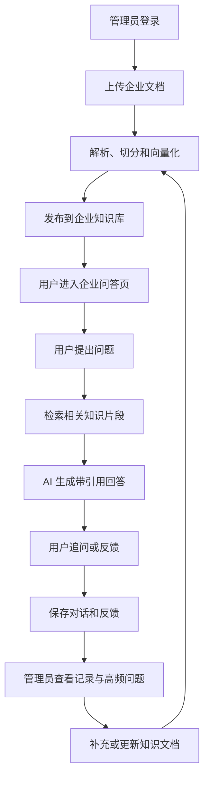
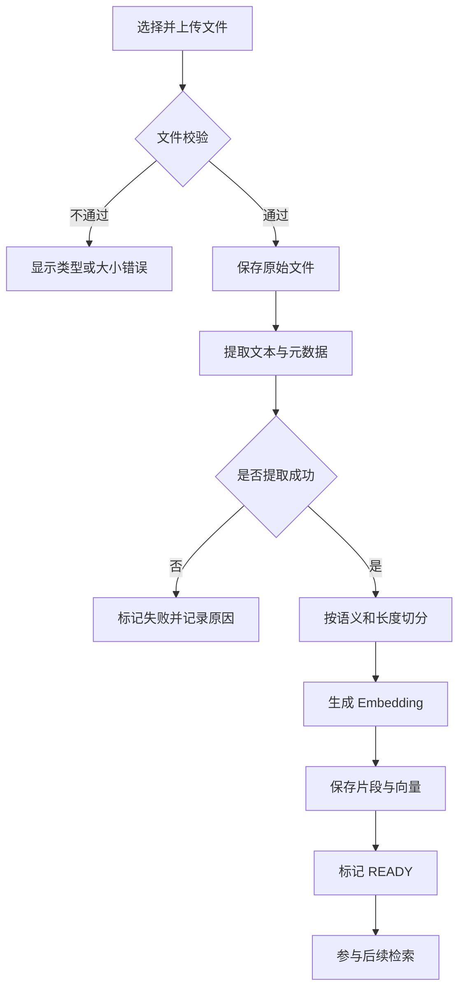
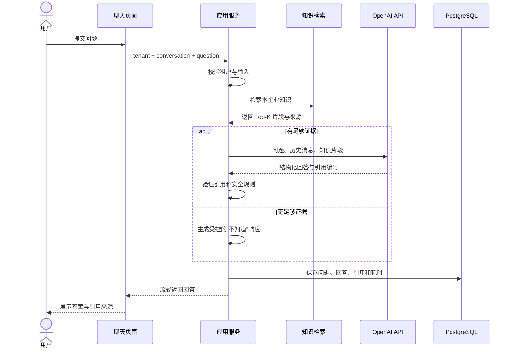
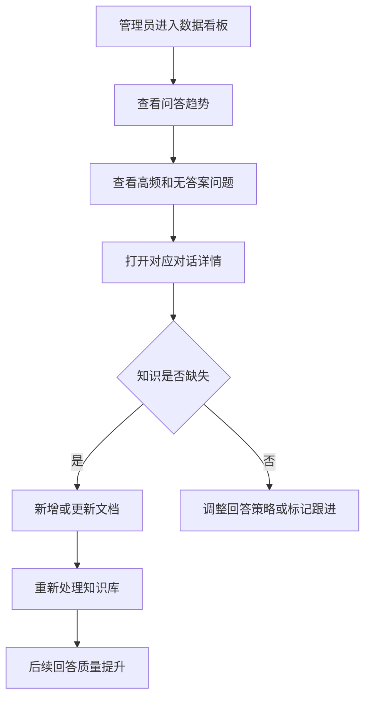
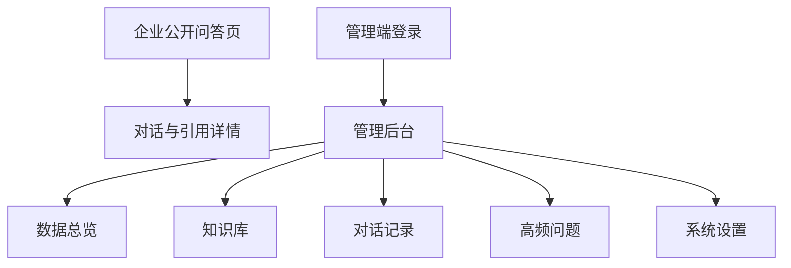
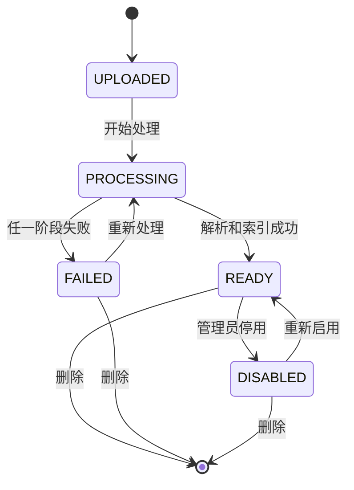
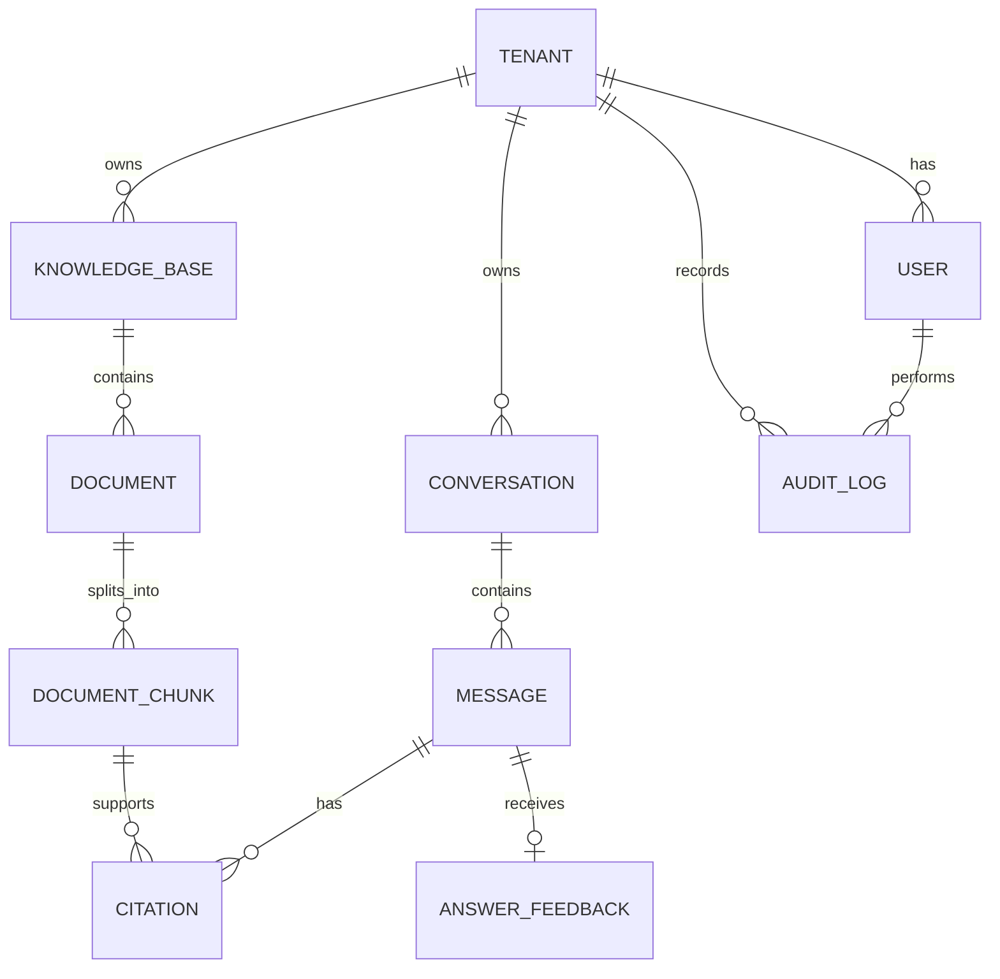
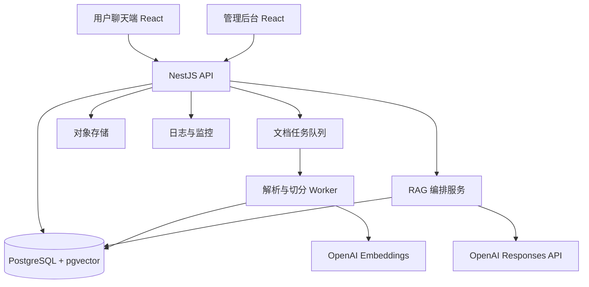
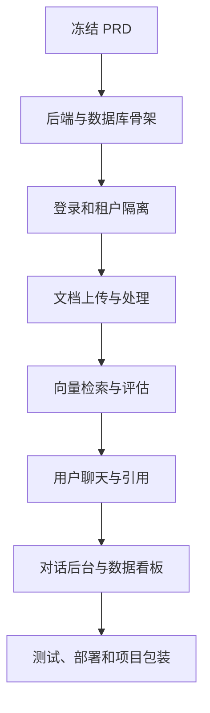

# 企业 AI 智能客服与知识库系统 PRD

> 项目名称：AI Support Copilot  
> 项目仓库：<https://github.com/yangzhiyan/ai-support-copilot>  
> 文档版本：v1.0  
> 当前阶段：需求设计  
> 更新时间：2026-08-08

---

## 1. 项目概述

### 1.1 一句话介绍

企业上传自己的产品文档、FAQ 和服务政策后，系统自动建立专属 AI 知识库；用户可以通过聊天窗口提问，AI 仅根据企业资料回答并标注引用来源，管理员可以维护知识、查看对话记录并分析高频问题。

### 1.2 项目定位

这不是一个通用聊天机器人，也不仅是一个静态客服工作台，而是一个完整的企业级 AI 应用：

- 对企业：降低重复咨询的人力成本，发现知识缺口。
- 对用户：快速获得有依据、可追溯的答案。
- 对管理员：集中管理企业资料、AI 对话和运营数据。
- 对求职展示：覆盖前端、后端、数据库、鉴权、文件处理、RAG、AI 工程、监控和部署。

### 1.3 项目解决的问题

企业的产品说明、内部流程和服务政策通常散落在 PDF、Markdown、网页或人工经验中，导致：

1. 用户难以快速找到准确答案。
2. 客服反复回答相同问题，响应效率低。
3. 普通大模型不了解企业私有资料，容易产生幻觉。
4. AI 回答没有引用来源，用户无法验证真实性。
5. 企业不知道用户最关心什么，也难以发现文档缺失。
6. 管理员缺乏统一入口维护资料和检查 AI 服务质量。

系统通过“企业文档 → 内容解析 → 知识检索 → AI 回答 → 引用溯源 → 对话分析”的闭环解决上述问题。

### 1.4 产品原则

1. **回答有依据**：AI 优先依据企业已发布资料作答。
2. **来源可追溯**：回答展示引用文档和原文片段。
3. **不知道就说明**：证据不足时不编造答案，引导用户补充问题或转人工。
4. **企业数据隔离**：不同企业的文档、用户和对话严格隔离。
5. **全流程可观察**：文档处理、检索、生成和失败都有明确状态。
6. **先完成闭环**：MVP 聚焦一条可演示主流程，不提前堆叠复杂功能。

---

## 2. 目标用户

| 角色               | 主要目标                         | 典型操作                                 |
| ------------------ | -------------------------------- | ---------------------------------------- |
| 访客/企业客户      | 快速获得产品或服务问题的答案     | 发起对话、查看引用、反馈答案是否有用     |
| 企业管理员         | 建立和维护企业 AI 知识库         | 上传文档、发布/停用文档、查看处理状态    |
| 客服/运营人员      | 检查 AI 服务质量并处理未解决问题 | 查看对话、筛选低质量回答、人工回复或接管 |
| 企业主管           | 了解客户需求和知识缺口           | 查看高频问题、未解决问题和使用趋势       |
| 平台管理员（后续） | 管理企业租户和平台运行           | 管理租户、配额、模型配置和系统状态       |

### 2.1 核心使用场景

- SaaS 产品将帮助文档上传后，为客户提供 7×24 小时问答。
- 电商或品牌方上传售后政策，让 AI 回答退款、物流和使用问题。
- 企业将内部制度和操作手册建立为员工知识助手。
- 运营人员根据高频问题补充 FAQ，持续提升回答质量。

---

## 3. 产品目标与指标

### 3.1 MVP 目标

完成一条可公开演示的端到端闭环：

1. 管理员登录并创建企业知识库。
2. 上传一份文档，系统完成解析、切分和索引。
3. 用户在公开聊天页提出问题。
4. 系统检索企业知识并生成带引用的回答。
5. 对话被保存，管理员可查看对话详情。
6. 管理员可查看基础高频问题和未解决问题统计。

### 3.2 成功指标

| 指标           | 定义                                   | MVP 目标          |
| -------------- | -------------------------------------- | ----------------- |
| 有依据回答率   | 包含至少一个有效企业知识引用的回答比例 | ≥ 90%（测试集）   |
| 引用准确率     | 引用片段确实支持回答结论的比例         | ≥ 90%（人工评估） |
| 无依据拒答率   | 资料中不存在答案时正确说明不知道的比例 | ≥ 90%             |
| 回答成功率     | 非系统错误的问答请求比例               | ≥ 98%             |
| 用户反馈覆盖   | 支持用户对每次回答标记有用/无用        | 100% 可操作       |
| 文档处理可见性 | 上传后的每个处理阶段都有状态或错误说明 | 100%              |

---

## 4. 产品范围

### 4.1 MVP 功能

#### A. 用户端 AI 问答

- 企业专属聊天页面。
- 新建对话和连续追问。
- 流式展示 AI 回答。
- 回答展示引用来源。
- 点击引用查看文档名称、片段和页码/章节（如可得）。
- 对回答标记“有用/无用”。
- 证据不足时明确拒答并建议重新描述或联系人工。

#### B. 管理员登录与企业空间

- 管理员邮箱密码登录、退出。
- 受保护的管理后台路由。
- 一个管理员属于一个企业空间（MVP 可用种子数据建立企业）。
- 所有业务数据按企业 `tenantId` 隔离。

#### C. 知识库管理

- 上传 PDF、Markdown、TXT 文档。
- 查看文档列表、大小、状态、更新时间和失败原因。
- 文档自动解析、切分、向量化并建立索引。
- 支持重新处理、停用和删除文档。
- 只有处理成功且已启用的文档参与检索。

#### D. 对话管理

- 查看对话列表和基本信息。
- 查看完整的用户问题、AI 回答和引用来源。
- 按时间、回答状态和用户反馈筛选。
- 标记需要人工跟进的对话。
- 保留 AI 请求耗时、模型、检索结果等必要调试信息。

#### E. 数据看板

- 对话总数。
- 问题总数。
- 有用/无用反馈数量与比例。
- 无答案问题数量。
- 高频问题 Top 10。
- 最近 7 天问答趋势。

### 4.2 MVP 不包含

- 在线支付和套餐计费。
- 完整的多渠道接入（Slack、WhatsApp、微信、电话等）。
- 复杂的企业组织架构和细粒度权限编辑器。
- AI 自动执行退款、删除账号等业务操作。
- 自动爬取任意网站。
- 多模型智能路由和多 Agent 工作流。
- 大规模人工客服排班与绩效系统。
- 自动聚类生成高频问题（MVP 可先使用标准化问题和计数实现）。

### 4.3 后续版本

| 版本 | 重点功能                                          |
| ---- | ------------------------------------------------- |
| V1.1 | DOCX/网页导入、文档版本、人工接管、后台客服工作台 |
| V1.2 | 多租户邀请、角色权限、可嵌入网站的 Chat Widget    |
| V1.3 | 问题聚类、知识缺口分析、自动生成 FAQ 草稿         |
| V2.0 | 多渠道、模型评估、配额计费、低风险工具调用        |

---

## 5. 系统角色与权限

| 功能               | 访客 | 客服/运营 | 企业管理员 | 平台管理员 |
| ------------------ | ---: | --------: | ---------: | ---------: |
| 使用企业 AI 问答   |    ✓ |         ✓ |          ✓ |          - |
| 提交回答反馈       |    ✓ |         ✓ |          ✓ |          - |
| 查看本企业对话     |    - |         ✓ |          ✓ |     按授权 |
| 标记人工跟进       |    - |         ✓ |          ✓ |          - |
| 查看本企业看板     |    - |         ✓ |          ✓ |     按授权 |
| 上传和管理知识文档 |    - |         - |          ✓ |     按授权 |
| 管理企业成员       |    - |         - |       后续 |          ✓ |
| 管理所有租户       |    - |         - |          - |       后续 |

> MVP 后端至少实现 `ADMIN` 和 `AGENT` 两种管理端角色。访客通过企业公开标识进入问答页，不拥有后台权限。

---

## 6. 核心业务流程

### 6.1 产品总流程



### 6.2 文档处理流程



### 6.3 AI 问答流程



### 6.4 管理员分析流程



---

## 7. 信息架构



### 7.1 页面清单

| 页面           | 用户        | MVP | 主要内容                                   |
| -------------- | ----------- | --- | ------------------------------------------ |
| 企业 AI 问答页 | 访客        | 是  | 欢迎语、推荐问题、对话、输入框、引用、反馈 |
| 管理端登录页   | 管理员/客服 | 是  | 邮箱密码登录、错误反馈                     |
| 数据总览       | 管理员/客服 | 是  | 核心指标、高频问题、趋势图、未解决问题     |
| 知识库列表     | 管理员      | 是  | 上传、状态、启停、重新处理、删除           |
| 文档详情       | 管理员      | 是  | 元数据、解析状态、片段预览、错误信息       |
| 对话列表       | 管理员/客服 | 是  | 搜索、筛选、反馈、未解决状态               |
| 对话详情       | 管理员/客服 | 是  | 完整消息、引用、AI 元数据、人工跟进        |
| 企业设置       | 管理员      | P1  | 名称、Logo、欢迎语、AI 风格和公开标识      |

### 7.2 已有三栏页面的归属

当前已经完成的“工单列表 + 对话 + AI 建议”静态页面不需要丢弃，可调整为后续的**人工客服审查/接管工作台**：

- 左栏：需要人工跟进的对话列表。
- 中栏：用户与 AI 的完整对话。
- 右栏：AI 对话摘要、引用、风险提示和人工建议回复。

该模块属于 V1.1，不阻塞 MVP 的用户问答和知识库闭环。

---

## 8. 功能需求

优先级定义：P0 为 MVP 必须；P1 为重要增强；P2 为后续能力。

### 8.1 用户端问答

| 编号    | 优先级 | 需求                           | 验收标准                                  |
| ------- | ------ | ------------------------------ | ----------------------------------------- |
| CHAT-01 | P0     | 用户可在企业公开页面发起新对话 | 首次提问创建会话并展示用户消息            |
| CHAT-02 | P0     | 支持基于历史消息连续追问       | 同一会话内携带必要上下文，不混入其他会话  |
| CHAT-03 | P0     | 回答以流式方式展示             | 首个内容返回前显示生成状态，内容逐步出现  |
| CHAT-04 | P0     | 回答展示引用标记               | 引用能对应到本次检索到的企业知识片段      |
| CHAT-05 | P0     | 用户可展开引用详情             | 显示文档名、相关片段及页码/章节（如存在） |
| CHAT-06 | P0     | 无可靠依据时受控拒答           | 不伪造引用，提示重新描述或联系人工        |
| CHAT-07 | P0     | 用户可标记有用/无用            | 每条 AI 回答最多保留一个当前反馈，可修改  |
| CHAT-08 | P0     | 处理加载、超时、限流和失败     | 不丢失用户输入，提供清晰提示和重试入口    |
| CHAT-09 | P1     | 展示管理员配置的推荐问题       | 点击后作为新问题提交                      |

### 8.2 登录与租户隔离

| 编号    | 优先级 | 需求                     | 验收标准                                 |
| ------- | ------ | ------------------------ | ---------------------------------------- |
| AUTH-01 | P0     | 管理员使用邮箱和密码登录 | 正确凭据进入后台，错误凭据不泄露账户细节 |
| AUTH-02 | P0     | 管理端路由需要登录       | 未登录访问时跳转登录页                   |
| AUTH-03 | P0     | 支持安全退出和会话过期   | 退出或过期后不能继续调用受保护 API       |
| AUTH-04 | P0     | 所有数据请求按租户过滤   | A 企业账号无法读取或修改 B 企业数据      |
| AUTH-05 | P0     | 后端执行角色权限校验     | 不依赖前端隐藏按钮作为权限控制           |

### 8.3 知识库管理

| 编号  | 优先级 | 需求                   | 验收标准                                             |
| ----- | ------ | ---------------------- | ---------------------------------------------------- |
| KB-01 | P0     | 上传 PDF、MD、TXT      | 校验文件类型、大小和空文件，显示上传进度             |
| KB-02 | P0     | 展示文档处理状态       | `UPLOADED/PROCESSING/READY/FAILED/DISABLED` 状态明确 |
| KB-03 | P0     | 自动解析、切分并向量化 | 成功后产生可检索片段，失败记录具体阶段和原因         |
| KB-04 | P0     | 查看文档详情和片段预览 | 管理员能检查系统实际提取的文本                       |
| KB-05 | P0     | 重新处理失败文档       | 重试不会生成重复的有效片段                           |
| KB-06 | P0     | 启用或停用文档         | 停用后不参与新问题检索                               |
| KB-07 | P0     | 删除文档               | 二次确认；原文件和当前索引按策略删除                 |
| KB-08 | P1     | 文档版本管理           | 更新文档时保留版本和引用追溯                         |

### 8.4 对话管理

| 编号    | 优先级 | 需求                         | 验收标准                                           |
| ------- | ------ | ---------------------------- | -------------------------------------------------- |
| CONV-01 | P0     | 查看本企业对话列表           | 默认按最后活动时间倒序并支持分页                   |
| CONV-02 | P0     | 按时间、反馈、是否有答案筛选 | 筛选条件反映到服务端查询中                         |
| CONV-03 | P0     | 查看完整对话详情             | 展示问题、回答、引用、反馈和时间                   |
| CONV-04 | P0     | 查看必要的 AI 调试信息       | 展示模型、耗时、检索片段数量和错误类型，不暴露密钥 |
| CONV-05 | P0     | 标记需要人工跟进             | 标记结果可筛选并记录操作人和时间                   |
| CONV-06 | P1     | 客服人工接管并回复           | 人工消息与 AI 消息清楚区分                         |

### 8.5 数据看板与高频问题

| 编号   | 优先级 | 需求                  | 验收标准                               |
| ------ | ------ | --------------------- | -------------------------------------- |
| ANA-01 | P0     | 展示会话数和问题数    | 支持最近 7 天和 30 天时间范围          |
| ANA-02 | P0     | 展示回答反馈统计      | 有用、无用和未反馈数量计算一致         |
| ANA-03 | P0     | 展示无答案问题        | 可跳转到对应对话详情                   |
| ANA-04 | P0     | 展示高频问题 Top 10   | MVP 使用标准化问题文本聚合，并展示次数 |
| ANA-05 | P0     | 展示最近 7 天问答趋势 | 图表与服务端聚合数据一致               |
| ANA-06 | P1     | AI 聚类相似问题       | 聚类结果可人工检查和调整               |

---

## 9. 关键状态与异常处理

### 9.1 文档状态



### 9.2 边界场景

| 场景                         | 系统行为                                           |
| ---------------------------- | -------------------------------------------------- |
| 上传不支持的文件             | 上传前后均校验，提示支持格式和限制                 |
| PDF 是扫描图片且无法提取文本 | 标记失败并说明暂不支持 OCR，后续版本处理           |
| 文档处理任务中断             | 保存失败阶段，可安全重试且不产生重复片段           |
| 未检索到相关知识             | 返回受控拒答，不调用或限制调用生成模型             |
| 检索片段相关性很低           | 不展示虚假引用，建议用户换一种问法                 |
| OpenAI 请求超时              | 保存失败记录，向用户提供重试，不影响后台浏览       |
| 用户重复提交问题             | 前端禁用提交，后端使用请求 ID 防重复写入           |
| 用户快速切换会话             | 取消或忽略旧请求，不能把回答写入错误会话           |
| 文档已停用                   | 新问答不再检索；历史对话保留当时引用快照           |
| 越权访问其他租户资源         | 返回 404/403 且不泄露资源内容                      |
| 恶意提示要求忽略知识库       | 系统提示词和数据边界优先，不泄露内部提示或其他数据 |

---

## 10. 数据模型

### 10.1 实体关系



### 10.2 核心表

#### Tenant

| 字段                  | 类型     | 说明                   |
| --------------------- | -------- | ---------------------- |
| id                    | UUID     | 企业 ID                |
| name                  | string   | 企业名称               |
| slug                  | string   | 公开问答页标识，唯一   |
| status                | enum     | ACTIVE / DISABLED      |
| settings              | JSON     | 欢迎语、回答风格等配置 |
| createdAt / updatedAt | datetime | 时间戳                 |

#### User

| 字段         | 类型   | 说明              |
| ------------ | ------ | ----------------- |
| id           | UUID   | 用户 ID           |
| tenantId     | UUID   | 所属企业          |
| name         | string | 姓名              |
| email        | string | 登录邮箱          |
| passwordHash | string | 密码哈希          |
| role         | enum   | ADMIN / AGENT     |
| status       | enum   | ACTIVE / DISABLED |

#### Document

| 字段                  | 类型     | 说明           |
| --------------------- | -------- | -------------- |
| id                    | UUID     | 文档 ID        |
| tenantId              | UUID     | 所属企业       |
| knowledgeBaseId       | UUID     | 所属知识库     |
| name                  | string   | 原始文件名     |
| mimeType              | string   | 文件类型       |
| size                  | integer  | 文件大小       |
| storageKey            | string   | 原文件存储位置 |
| status                | enum     | 文档处理状态   |
| errorMessage          | text?    | 失败说明       |
| createdBy             | UUID     | 上传者         |
| createdAt / updatedAt | datetime | 时间戳         |

#### DocumentChunk

| 字段         | 类型     | 说明                       |
| ------------ | -------- | -------------------------- |
| id           | UUID     | 片段 ID                    |
| tenantId     | UUID     | 冗余租户字段，用于强制隔离 |
| documentId   | UUID     | 来源文档                   |
| content      | text     | 片段文本                   |
| position     | integer  | 在文档中的顺序             |
| pageNumber   | integer? | PDF 页码                   |
| sectionTitle | string?  | 章节标题                   |
| tokenCount   | integer  | 估算 token 数              |
| embedding    | vector   | 向量表示                   |

#### Conversation

| 字段                      | 类型     | 说明                              |
| ------------------------- | -------- | --------------------------------- |
| id                        | UUID     | 对话 ID                           |
| tenantId                  | UUID     | 所属企业                          |
| visitorId                 | string   | 匿名访客标识                      |
| title                     | string?  | 根据首个问题生成的标题            |
| status                    | enum     | ACTIVE / NEEDS_FOLLOW_UP / CLOSED |
| startedAt / lastMessageAt | datetime | 时间戳                            |

#### Message

| 字段                        | 类型     | 说明                              |
| --------------------------- | -------- | --------------------------------- |
| id                          | UUID     | 消息 ID                           |
| conversationId              | UUID     | 所属对话                          |
| role                        | enum     | USER / ASSISTANT / HUMAN / SYSTEM |
| content                     | text     | 消息内容                          |
| status                      | enum     | PENDING / COMPLETED / FAILED      |
| model                       | string?  | 使用模型                          |
| latencyMs                   | integer? | 响应耗时                          |
| promptTokens / outputTokens | integer? | 用量统计                          |
| errorCode                   | string?  | 失败类型                          |
| createdAt                   | datetime | 创建时间                          |

#### Citation

| 字段          | 类型    | 说明               |
| ------------- | ------- | ------------------ |
| id            | UUID    | 引用 ID            |
| messageId     | UUID    | 所属 AI 消息       |
| chunkId       | UUID    | 来源知识片段       |
| quoteSnapshot | text    | 生成当时的引用快照 |
| rank          | integer | 检索排序           |
| score         | float?  | 相关度分数         |

---

## 11. API 初步设计

### 11.1 通用约定

- API 前缀：`/api/v1`。
- 管理端使用安全会话或短期访问令牌 + HttpOnly Cookie。
- 公开问答接口通过企业 `slug` 确定租户，服务端不接受客户端任意指定 `tenantId`。
- 请求和响应使用 JSON；文件上传使用 `multipart/form-data`。
- 时间使用 UTC ISO 8601，页面按用户时区展示。
- 错误响应统一包含 `code`、`message` 和可选 `details`。
- 列表接口分页；关键写操作使用幂等请求 ID。

### 11.2 公开问答接口

| 方法 | 路径                                     | 用途                   |
| ---- | ---------------------------------------- | ---------------------- |
| GET  | `/public/assistants/:slug`               | 获取企业问答页公开配置 |
| POST | `/public/assistants/:slug/conversations` | 新建对话               |
| POST | `/public/conversations/:id/messages`     | 提交问题并获取流式回答 |
| GET  | `/public/conversations/:id/messages`     | 恢复当前访客的对话消息 |
| PUT  | `/public/messages/:id/feedback`          | 提交或修改回答反馈     |

### 11.3 管理端接口

| 方法   | 路径                       | 用途           | 权限   |
| ------ | -------------------------- | -------------- | ------ |
| POST   | `/auth/login`              | 登录           | 公开   |
| POST   | `/auth/logout`             | 退出           | 已登录 |
| GET    | `/auth/me`                 | 当前用户       | 已登录 |
| GET    | `/documents`               | 文档列表       | Agent+ |
| POST   | `/documents`               | 上传文档       | Admin  |
| GET    | `/documents/:id`           | 文档详情与片段 | Agent+ |
| POST   | `/documents/:id/reprocess` | 重新处理       | Admin  |
| PATCH  | `/documents/:id/status`    | 启用/停用      | Admin  |
| DELETE | `/documents/:id`           | 删除文档       | Admin  |
| GET    | `/conversations`           | 对话列表       | Agent+ |
| GET    | `/conversations/:id`       | 对话详情       | Agent+ |
| PATCH  | `/conversations/:id`       | 标记跟进/关闭  | Agent+ |
| GET    | `/analytics/overview`      | 核心统计       | Agent+ |
| GET    | `/analytics/top-questions` | 高频问题       | Agent+ |
| GET    | `/analytics/unanswered`    | 无答案问题     | Agent+ |

### 11.4 AI 回答结构

后端应约束模型返回结构，避免只处理无法验证的自由文本：

```ts
type GroundedAnswer = {
  answer: string
  hasSufficientEvidence: boolean
  citations: Array<{
    chunkId: string
    quote: string
  }>
  suggestedFollowUpQuestions: string[]
}
```

服务端验证 `chunkId` 必须来自本次检索结果，并使用数据库中的可信元数据生成前端最终引用。

---

## 12. 技术架构

### 12.1 推荐技术栈

| 层级       | 技术                                  | 选择理由                                     |
| ---------- | ------------------------------------- | -------------------------------------------- |
| 前端       | React + TypeScript + Vite             | 延续现有项目，类型安全、开发体验成熟         |
| UI         | Ant Design                            | 快速构建企业后台、表格、表单和上传交互       |
| 样式       | SCSS Modules                          | 组件样式就近管理，避免全局污染               |
| 请求与缓存 | TanStack Query                        | 管理缓存、加载、错误、重试和请求失效         |
| 图表       | ECharts                               | 适合高频问题和趋势分析，可体现已有技能       |
| 后端       | Node.js + TypeScript + NestJS         | 模块化、依赖注入、校验和测试体系适合完整项目 |
| API 文档   | OpenAPI / Swagger                     | 自动生成并便于前后端联调                     |
| ORM        | Prisma                                | 数据模型和迁移清晰，TypeScript 类型体验好    |
| 数据库     | PostgreSQL                            | 保存租户、文档、对话、消息和统计数据         |
| 向量检索   | PostgreSQL + pgvector                 | MVP 减少基础设施，后续可替换专用向量库       |
| AI         | OpenAI Responses API + Embeddings API | 生成回答和文档向量，模型名通过配置管理       |
| 文件存储   | 本地开发目录 / S3 兼容对象存储        | 数据库只保存元数据和存储键                   |
| 后台任务   | BullMQ + Redis（M1 后半）             | 文档解析和向量化不阻塞上传请求               |
| 测试       | Vitest、RTL、Supertest、Playwright    | 覆盖单元、组件、接口和端到端流程             |
| 部署       | Docker、托管 PostgreSQL、云端前后端   | 提供可复现环境与公开演示                     |

> 后端在 NestJS 与 Express 之间选择 **NestJS**。原因不是功能更多，而是该项目包含鉴权、租户、文档、对话、AI、分析等多个模块，NestJS 更利于展示企业级模块边界、依赖注入和测试能力。

### 12.2 系统架构图



### 12.3 RAG 数据流


### 12.4 推荐仓库结构

```text
ai-support-copilot/
├── frontend/
│   ├── src/
│   │   ├── api/
│   │   ├── components/
│   │   ├── features/
│   │   │   ├── auth/
│   │   │   ├── chat/
│   │   │   ├── documents/
│   │   │   ├── conversations/
│   │   │   └── analytics/
│   │   ├── layouts/
│   │   ├── pages/
│   │   ├── routes/
│   │   ├── styles/
│   │   └── types/
│   └── package.json
├── backend/
│   ├── src/
│   │   ├── auth/
│   │   ├── tenants/
│   │   ├── users/
│   │   ├── documents/
│   │   ├── knowledge/
│   │   ├── conversations/
│   │   ├── ai/
│   │   ├── analytics/
│   │   ├── audit/
│   │   └── common/
│   ├── prisma/
│   └── package.json
├── docs/
│   └── product-requirements.md
├── docker-compose.yml
└── README.md
```

---

## 13. AI 与 RAG 设计

### 13.1 文档摄取

1. 校验文件与企业权限。
2. 将原文件保存到对象存储。
3. 提取正文、页码和章节等元数据。
4. 清理无意义空白和重复内容。
5. 按语义边界与 token 长度切分，保留适量重叠。
6. 批量生成 Embedding。
7. 将片段、元数据和向量写入 PostgreSQL/pgvector。
8. 文档状态变更为 `READY`。

### 13.2 检索策略

- 检索必须强制添加 `tenantId` 和文档启用状态过滤。
- MVP 使用向量相似度 Top-K 检索。
- 设置最低相关度阈值；低于阈值视为证据不足。
- 后续可加入关键词混合检索、重排序和查询改写。
- 连续追问时，只传入必要历史消息，避免上下文无限增长。

### 13.3 回答与引用

- 模型只能使用提供的知识片段回答企业事实问题。
- 模型输出结构化 JSON/Schema，引用使用片段 ID。
- 服务端验证片段 ID 后，再补充文档名、页码和引用快照。
- 历史引用保存快照，避免文档更新后无法解释旧回答。
- 没有足够证据时返回固定的安全拒答逻辑。

### 13.4 Prompt Injection 防护

- 企业文档视为不可信数据，不允许其改变系统指令。
- 用户要求“忽略之前指令”时仍保持知识边界。
- 不向模型提供数据库连接、API 密钥或其他租户内容。
- 对输入长度、频率和文件内容做限制。
- 输出经过 Schema、引用一致性和基本安全检查。

### 13.5 AI 降级策略

- OpenAI 不可用时，知识库管理和后台查询仍可正常使用。
- 问答失败时保留问题，记录失败类型并允许重试。
- 提供开发/演示 Mock 模式，避免演示完全依赖外部网络和额度。
- 模型、温度、最大输出和超时通过服务端配置统一管理。

---

## 14. 非功能需求

### 14.1 性能

- 管理端普通查询 P95 小于 800ms。
- 文档上传接口在保存任务后尽快响应，不同步等待完整向量化。
- AI 首个流式内容目标在 3 秒内出现，完整回答目标在 15 秒内完成。
- 所有列表分页；文档片段按需加载。
- 对相同高频问题可在后续加入语义缓存，但不得跨租户复用私有答案。

### 14.2 安全与隐私

- 全站 HTTPS，密钥只存在服务端环境变量。
- 密码使用 Argon2 或 bcrypt 哈希。
- 文件名、MIME、大小和实际内容类型均校验。
- 文档解析在受限环境执行，防止恶意文件利用解析器。
- 后端每次数据访问都执行租户过滤和角色授权。
- 防止 XSS、SQL 注入、CSRF、暴力登录和滥用 AI 接口。
- 日志不保存密码、Token、API Key 或不必要的完整私密内容。
- 公开演示只使用虚构企业和模拟资料。

### 14.3 可用性与无障碍

- 上传、处理、检索和生成过程均有清晰反馈。
- 状态不能只依赖颜色表达。
- 核心操作可使用键盘完成。
- 文本对比度满足 WCAG AA 基本要求。
- 移动端聊天可用；管理后台至少支持平板和桌面端。

### 14.4 可维护性

- TypeScript 严格模式，禁止无理由使用 `any`。
- ESLint、Prettier、SCSS Modules 和保存格式化保持现有规范。
- 组件私有样式放在组件目录；真正全局样式放在 `styles`。
- Controller 只负责协议层，业务逻辑放在 Service/Domain 层。
- DTO 和配置执行运行时校验。
- 数据库迁移、种子数据、API 文档和环境变量示例纳入仓库。

### 14.5 可观测性

- 请求包含 request ID，可串联 API、检索和模型调用。
- 记录文档处理阶段、耗时和失败原因。
- 记录问答耗时、模型、token 用量、检索数量和反馈。
- 看板统计来自结构化字段，不依赖扫描原始日志。
- 生产错误日志对用户内容做必要脱敏。

---

## 15. 测试与 AI 评估

| 层级         | 重点                                           | 工具建议              |
| ------------ | ---------------------------------------------- | --------------------- |
| 单元测试     | 文本切分、租户过滤、权限、引用校验、问题标准化 | Vitest/Jest           |
| 组件测试     | 聊天流式状态、引用展开、上传状态、筛选         | React Testing Library |
| API 集成测试 | 登录、越权、上传、分页、反馈、失败重试         | Supertest             |
| 数据库测试   | 外键、唯一约束、事务、迁移、租户隔离           | Prisma + 测试库       |
| E2E          | 上传文档到问答与后台查看的完整链路             | Playwright            |
| RAG 评估     | 正确性、引用支撑、拒答、跨租户隔离             | 固定问题集 + 人工评分 |

### 15.1 MVP 必测场景

1. 管理员上传有效文档，最终状态变为 `READY`。
2. 无效文件和解析失败时显示可理解的错误。
3. 用户询问文档内问题，回答正确且引用支持结论。
4. 用户询问文档外问题，系统不编造企业政策。
5. 连续追问能使用本对话上下文，不混入其他对话。
6. A 企业无法查询 B 企业的文档、向量或对话。
7. 停用文档后，新问题不再引用该文档。
8. 对回答的反馈能在后台统计中正确体现。
9. OpenAI 超时后问题不丢失，允许安全重试。
10. 至少一条 E2E 覆盖“登录 → 上传 → 处理 → 提问 → 引用 → 后台查看”。

### 15.2 AI 评估集

为演示企业准备至少 30 个固定问题：

- 15 个文档内可直接回答的问题。
- 5 个需要结合两个片段回答的问题。
- 5 个表达不同但语义相同的问题。
- 5 个资料中不存在答案、必须拒答的问题。

每次修改切分、检索、Prompt 或模型后重新运行评估，记录正确性、引用准确性和拒答表现。

---

## 16. MVP 验收标准

- [ ] 管理员能安全登录和退出管理后台。
- [ ] 企业数据具备后端租户隔离。
- [ ] 管理员能上传 PDF、Markdown 和 TXT 文档。
- [ ] 文档具有上传、处理、完成、失败和停用状态。
- [ ] 文档成功解析、切分、向量化并可被检索。
- [ ] 用户能在企业公开页面进行连续问答。
- [ ] AI 回答使用企业知识并显示可验证引用。
- [ ] 资料不足时系统明确拒答，不伪造来源。
- [ ] 用户能提交有用/无用反馈。
- [ ] 管理员能查看对话列表和完整详情。
- [ ] 看板展示会话数、反馈、无答案问题、高频问题和趋势。
- [ ] 数据保存于 PostgreSQL，刷新页面后不丢失。
- [ ] 核心接口具备输入校验、权限和错误处理。
- [ ] 单元、接口和主流程 E2E 测试通过。
- [ ] RAG 固定评估集达到文档定义的基础目标。
- [ ] `lint`、`format:check`、`test` 和 `build` 全部通过。
- [ ] README 能指导新开发者使用 Docker 或明确命令启动项目。
- [ ] 提供公开演示地址或稳定演示视频，且不包含真实企业私密数据。

---

## 17. 开发里程碑

| 阶段       | 目标                   | 交付物                                         |
| ---------- | ---------------------- | ---------------------------------------------- |
| M0（当前） | 明确产品需求和工程规范 | PRD、静态页面、ESLint、Prettier、SCSS Modules  |
| M1         | 建立基础后端与数据库   | NestJS、Prisma、PostgreSQL、Swagger、健康检查  |
| M2         | 管理员登录与租户模型   | 鉴权、角色、Tenant、路由保护、种子账号         |
| M3         | 知识库文件管理         | 上传、对象存储、列表、状态、删除、片段预览     |
| M4         | RAG 文档处理           | 解析、切分、Embedding、pgvector、检索测试      |
| M5         | 用户端 AI 问答         | 公开聊天页、连续对话、流式回答、引用、反馈     |
| M6         | 管理端对话与分析       | 对话记录、详情、高频问题、无答案、趋势图       |
| M7         | 质量与部署             | 权限安全、测试、评估集、Docker、监控、线上演示 |
| M8（后续） | 人工客服协作           | 将现有三栏页面改造为审查和人工接管工作台       |

### 17.1 推荐实施顺序



---

## 18. 求职展示设计

### 18.1 3–5 分钟演示流程

1. 以企业管理员身份登录。
2. 上传一份新的产品帮助文档。
3. 展示后台异步处理状态和文档片段预览。
4. 打开企业公开 AI 问答页，询问文档内问题。
5. 展示流式回答、引用文档、原文片段和页码。
6. 提问一个资料中没有答案的问题，展示安全拒答。
7. 提交回答反馈。
8. 回到后台查看对话记录、高频问题和无答案统计。
9. 简述租户隔离、RAG 评估、失败降级和部署架构。

### 18.2 项目亮点

- 不只是调用 Chat API，而是实现完整 RAG 数据链路。
- 引用经过服务端验证，降低模型伪造来源的风险。
- 从设计上支持企业租户隔离，具有真实 SaaS 架构意识。
- 文档处理采用异步任务和明确状态机。
- 用固定评估集量化检索与回答质量。
- 同时覆盖用户端、企业后台、API、数据库、AI 和 DevOps。
- 保留人工接管扩展，体现 AI 系统的现实边界。

### 18.3 FDE 面试可讲内容

- 如何将模糊的“做一个企业 AI 客服”拆成可交付 MVP。
- 如何根据企业资料设计数据摄取、检索和引用流程。
- 如何处理客户特有需求、数据隔离和安全边界。
- 如何通过日志与评估定位“检索错”还是“生成错”。
- 如何设计模型失败时的人工流程和演示降级方案。
- 如何在需求完整性、开发速度和基础设施复杂度之间取舍。

---

## 19. 风险与应对

| 风险                         | 影响                 | 应对                                             |
| ---------------------------- | -------------------- | ------------------------------------------------ |
| MVP 范围过大                 | 长期不能形成完整作品 | 只让 P0 阻塞 MVP，人工工作台移至 M8              |
| AI 幻觉或伪造引用            | 降低可信度           | 阈值、拒答、结构化输出、引用校验、评估集         |
| 跨企业数据泄露               | 严重安全问题         | 服务端 tenant 过滤、复合索引、越权测试、日志审计 |
| 文档解析效果不稳定           | 检索不到正确内容     | MVP 限定格式，片段预览，失败可重试               |
| 大文件处理阻塞 API           | 上传超时、体验差     | 异步队列、状态轮询、幂等任务                     |
| OpenAI 网络或额度失败        | 演示中断             | 超时重试、Mock 模式、预置演示数据                |
| 高频问题统计失真             | 看板价值不足         | MVP 明确为文本标准化计数，后续再做语义聚类       |
| Codex 完成代码但本人理解不足 | 面试无法解释         | 每个里程碑结束后讲解、画数据流并独立完成小改动   |

---

## 20. 待确认产品决策

以下问题在对应里程碑开始前确认，不阻塞当前 PRD：

1. 演示企业选择什么行业，以及第一批示例文档内容。
2. 公开问答页是否允许匿名用户恢复历史对话。
3. 文件大小上限以及 PDF 是否在后续支持 OCR。
4. 文档删除采用立即物理删除还是短期软删除。
5. 高频问题 MVP 使用标准化文本统计的具体规则。
6. 是否在 V1.1 加入网站嵌入式 Chat Widget。

---

## 21. 术语表

| 术语             | 说明                                               |
| ---------------- | -------------------------------------------------- |
| RAG              | 先检索企业知识，再让模型基于检索内容回答           |
| Embedding        | 将文本转为向量，用于语义相似度搜索                 |
| Chunk            | 从文档切分出的可检索文本片段                       |
| Citation         | 回答所依据的文档、片段、页码等来源信息             |
| Tenant           | 使用系统的一家企业，是数据隔离边界                 |
| Grounded Answer  | 有给定知识证据支撑的回答                           |
| Prompt Injection | 通过用户或文档内容试图覆盖系统规则的攻击           |
| Copilot          | 辅助完成任务、保留人工监督的 AI 能力               |
| FDE              | 面向真实客户部署、集成并交付 AI 解决方案的工程角色 |

---

## 22. 文档变更记录

| 版本 | 日期       | 说明                                       |
| ---- | ---------- | ------------------------------------------ |
| v1.0 | 2026-08-08 | 按企业 AI 智能客服与知识库方向建立完整 PRD |
